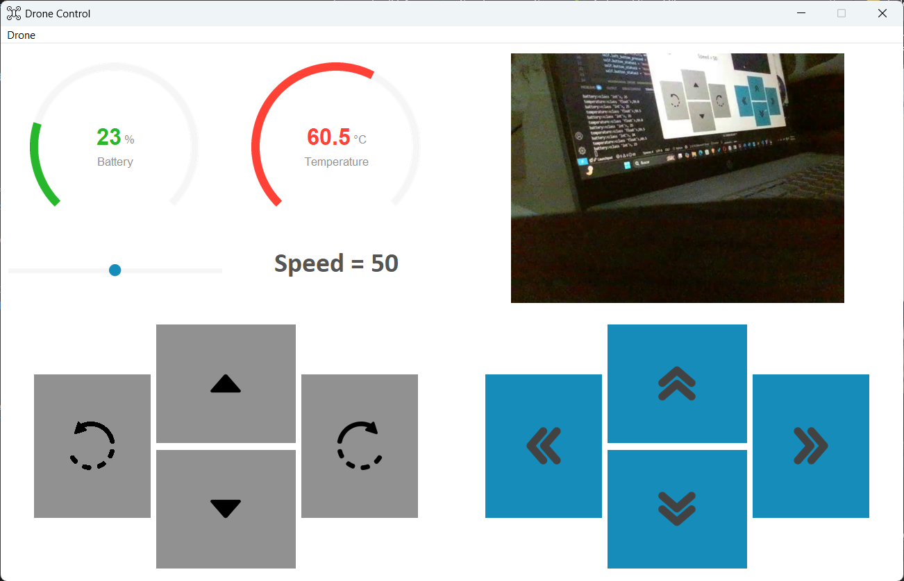

# tello-gui-controller
A sleek and responsive Graphical User Interface (GUI) built with Python and Ttkbootstrap for direct manual control of DJI Tello drones. This application leverages the djitellopy library to provide a seamless and intuitive piloting experience right from your computer.

## Features
- **Flight Control:** Simple buttons for takeoff, landing, and basic maneuvers.
- **Live Video Stream:** Embedded video feed from the Tello's camera.
- **Telemetry Data:** Real-time display of battery percentage, and battery.
- **Speed Settings:** Adjust the drone's flight speed with a slider control.

## Usage
1.  Ensure your Tello drone is powered on and connected to your computer's Wi-Fi.
2.  Run the main application script:
    ```bash
    python main.py
    ```
3.  Use the buttons to control the drone's flight and the slider to adjust its speed.

## Preview
> Preview: Windows
> 
> 

